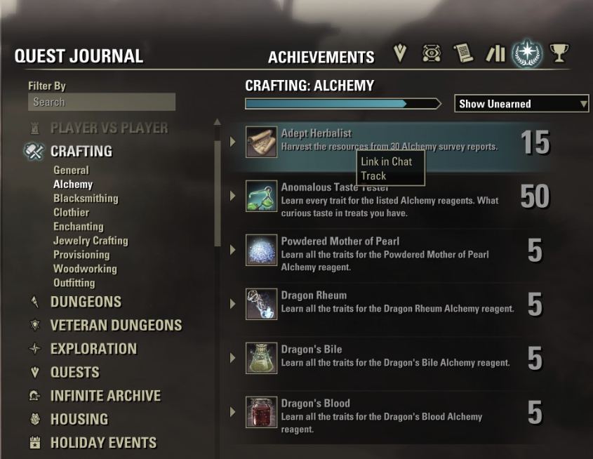

# Achievement Bar

An Elder Scrolls Online addon that adds a tracking bar for achievement progress to your HUD.

## Features

- Track the progress of a selected incomplete achievement
- Auto-hide during combat
- Automatic tracking of the next achievement in the series
  - If the achievement does not have a follow-up achievement, the bar disappears 
- The progress bar changes color based on completion percentage

## Installation

1. Download the latest release
2. Extract the contents to your ESO addons folder:
   `Documents/Elder Scrolls Online/live/AddOns/`
3. Enable the addon in the ESO addon settings

## Usage

1. Open the Achievements window
2. Right-click on any incomplete achievement
3. Select "Track" from the context menu
4. The achievement progress bar will appear on your HUD
5. Right-click the tracked achievement and select "Stop Tracking" to remove it

The progress bar will automatically:

- Hide during combat
- Update as you make progress
- Change colors based on progress (bronze <33%, silver 33-66%, gold >66%)
- Track the next achievement in the series when the current one completes or disappear if there is no follow-up achievement

## Saved Variables

The addon saves your currently tracked achievement between sessions in:
`AchievementBar_Data.lua`

## Issues
Please report any issues via the [issue tracker](https://github.com/asutalo/ESOAddons/issues) here on the repository.

## Screenshots
Achievements menu with the option to "Track" an achievement:

Achievements menu with the option to "Stop Tracking" a tracked achievement:

The achievement bar when active (bronze):

The achievement bar when active (silver):

The achievement bar when active (gold):

Chat message when an achievement is complete and there is no follow-up:

Chat message when an achievement is complete and there is a follow-up:
